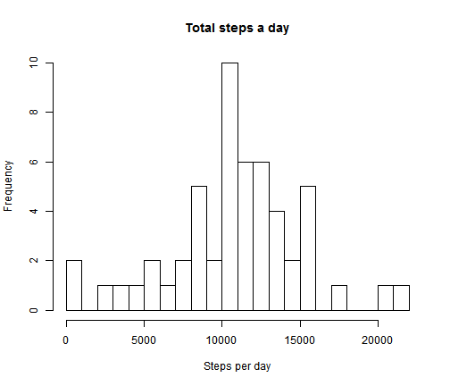
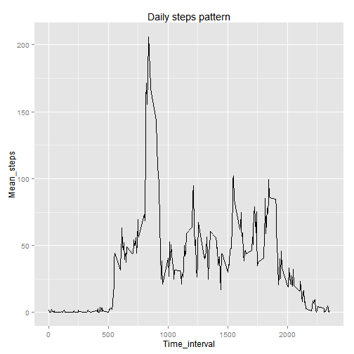
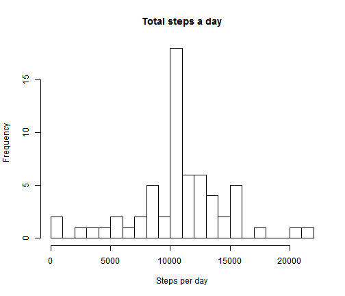
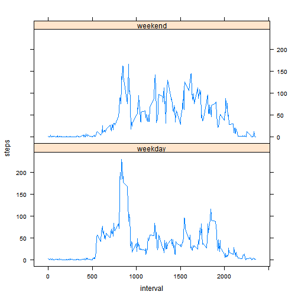

setwd("Z:/Dokumenty/Coursera/Literate Statistical Programming")  
Literate statistics programming course - Assignment 1
======================================

1. Loading and preprocessing the data
--------------

```r
activity <- read.csv("activity.csv")
```

2. What is mean total number of steps taken per day?
--------------

```r
total <- aggregate(activity$steps, by = list(activity$date), sum)
colnames(total) <- c("Day", "Steps")
hist(total$Steps, breaks = 20, main = "Total steps a day", xlab = "Steps per day")
```

 

```r
totalMean <- mean(total$Steps, na.rm = T)
totalMedian <- median(total$Steps, na.rm = T)
options(scipen=999, digits=2) #Convenient output
```
Total number of steps taken per day median is 10765 and mean 10766.19.

3. What is the average daily activity pattern?
---------------

```r
dayMean <- aggregate(activity$steps, by = list(activity$interval), function(x) mean(x, na.rm = TRUE))
colnames(dayMean) <- c("Time_interval", "Mean_steps")
library(ggplot2)
```

```
## Warning: package 'ggplot2' was built under R version 3.0.3
```

```r
ggplot(aes(x = Time_interval, y = Mean_steps), data = dayMean, group = 1) + 
  geom_line() +
  labs(title = "Daily steps pattern")
```

 

```r
maxPointer <- which(dayMean$Mean_steps == max(dayMean$Mean_steps))
maxMean <- dayMean[maxPointer,"Mean_steps"]
maxInt <- dayMean[maxPointer,"Time_interval"]
```
The highest average steps activity 206.17 is in the 835th interval.

4. Imputing missing values
----------


```r
missing <- sum(is.na(activity$steps))
```
The activity dataset contains 2304 missing values.
Therefore, the missing values were substituted with average day activity for the particular interval.


```r
#create a reference step object for the two months period as if there was average activity in every time interval
#find missing values in the original datase and use the same index to find values to impute
refStep <- rep(dayMean$Mean_steps, 61)
toSubstitute <- which(is.na(activity$steps))
activity2 <- activity
activity2$steps[toSubstitute] <- refStep[toSubstitute]
#characteristics of the missing values
substituted <- median(refStep[toSubstitute])
```

```r
total2 <- aggregate(activity2$steps, by = list(activity2$date), sum)
colnames(total2) <- c("Day", "Steps")
hist(total2$Steps, breaks = 20, main = "Total steps a day", xlab = "Steps per day")
```

 

```r
totalMean2 <- mean(total2$Steps, na.rm = T)
totalMedian2 <- median(total2$Steps, na.rm = T)
```

The daily steps median of the activity dataset with fixed NAs is 10766.19 and mean 10766.19. Median was robust against the NA values in the original dataset, mean shifted downwards in the corrected dataset. This is likely because the imputed values, which had to be ommited in the original dataset, were low, their median was 34.11. 

5. Are there differences in activity patterns between weekdays and weekends?
------------


```r
days <- weekdays(as.Date(activity2$date))
days[!(days %in% c("Saturday", "Sunday"))] <- "weekday"
days[days %in% c("Saturday", "Sunday")] <- "weekend"
activity2$day <- days
total2 <- aggregate(activity2[,c("steps", "interval")], by = list(activity2$interval, 
                                         "Days" = activity2$day), mean)

library(lattice)
```

```
## Warning: package 'lattice' was built under R version 3.0.3
```

```r
xyplot(steps ~ interval|Days, data = total2, type = "l", layout=c(1,2))
```

 
Average patterns of the weekdays and weekend days are different. There is a higher activity around time interval 

